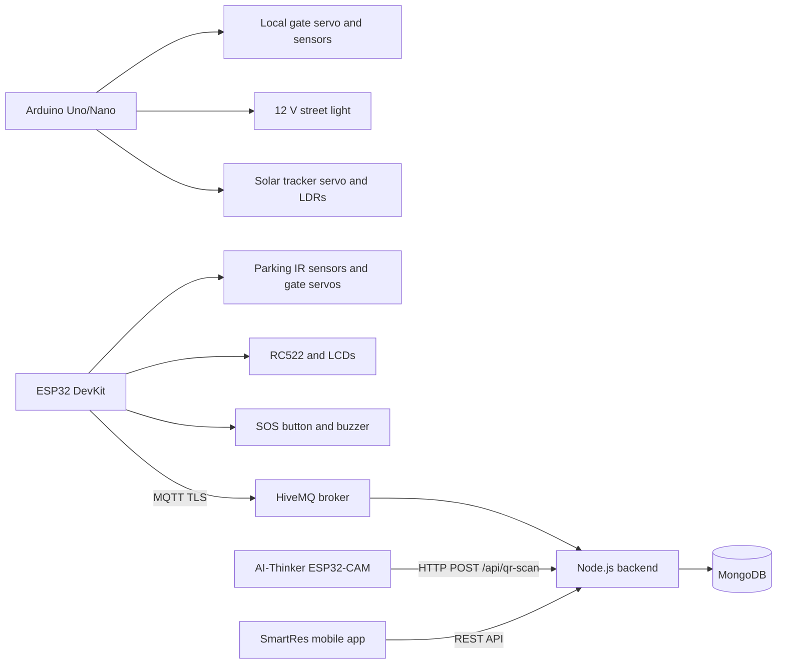

# Smart Residential IoT - Full Circuit and Wiring Guide

This guide maps the repository firmware to three separate controller assemblies:

1. Arduino Uno/Nano: entry gate, street light, and solar tracker.
2. ESP32 DevKit V1: parking sensors, two parking gates, RFID, LCDs, SOS, and MQTT.
3. AI-Thinker ESP32-CAM: visitor QR scanner and HTTP backend client.

The controllers communicate through the backend/network. Do not connect their
GPIO pins directly to each other.

## Diagrams

- [Complete system overview](./iot-system-overview.svg)
- [Arduino gate, light, and solar wiring](./arduino-gate-light-solar-wiring.svg)
- [ESP32 parking, RFID, LCD, and SOS wiring](./esp32-parking-rfid-wiring.svg)
- [ESP32-CAM power and programming wiring](./esp32-cam-wiring.svg)

## System Topology



## Electrical Safety and Power Plan

### Required supplies

| Assembly | Recommended supply | Notes |
|---|---:|---|
| Arduino controller | Regulated 5 V, 3 A minimum | Powers Uno, two small servos, sensors |
| Street light | 12 V supply sized for the light | Add an inline fuse near the supply |
| ESP32 parking controller | Regulated 5 V, 4 A minimum | Two servos can cause large current spikes |
| ESP32-CAM | Regulated 5 V, 1 A minimum | Weak USB-TTL 5 V outputs often cause brownouts |

### Mandatory rules

- Join all grounds inside each assembly: controller GND, sensor GND, servo GND,
  MOSFET source/emitter GND, and the local supply negative.
- Do not power servos from the controller's 3.3 V pin.
- Prefer a separate regulated 5 V servo rail. Keep its GND connected to the
  controller GND.
- Place a 470-1000 uF electrolytic capacitor and a 100 nF ceramic capacitor
  across each servo 5 V rail near the servo connectors.
- ESP32 GPIO pins are 3.3 V only and are not 5 V tolerant.
- Power the RC522 from 3.3 V only.
- Use bidirectional I2C level shifters when a 5 V LCD backpack pulls SDA/SCL up
  to 5 V.
- Never feed a 12 V street-light supply into an Arduino or ESP32 pin.

## Assembly 1 - Arduino Gate, Street Light, Solar Tracker

Firmware: `Node_Backend/Arduino/Arduino.ino`

### Exact pin map

| Arduino pin | Connects to | Module pin / component |
|---|---|---|
| D2 | HC-SR04 | TRIG |
| D3 | IR obstacle sensor | OUT, active LOW |
| D4 | HC-SR04 | ECHO |
| D5 | Gate servo | Signal |
| D6 | Street-light MOSFET | Gate through 220 ohm resistor |
| A0 | Street LDR module | AO |
| A1 | Left solar LDR divider | Divider midpoint |
| A2 | Right solar LDR divider | Divider midpoint |
| D10 | Solar servo | Signal |
| 5V | Sensors | HC-SR04 VCC and IR VCC |
| GND | All local modules | Common ground |

### Street-light MOSFET stage

Use a logic-level N-channel MOSFET such as IRLZ44N, FQP30N06L, or AO3400 for a
smaller load.

1. Arduino D6 -> 220 ohm -> MOSFET gate.
2. MOSFET gate -> 10 kohm -> GND.
3. MOSFET source -> GND.
4. MOSFET drain -> street-light negative.
5. Street-light positive -> fused +12 V.
6. 12 V supply negative -> Arduino/local GND.

The current firmware uses `digitalWrite()`, so the output is ON/OFF. Replace it
with `analogWrite(STREET_PWM, level)` only when PWM dimming is required.

### Solar LDR dividers

Build two identical dividers:

```text
+5 V --- LDR ---+--- 10 kohm --- GND
                |
                +--- A1 or A2
```

Place a small vertical shade between the left and right LDRs. If the tracker
moves away from the brighter side, swap A1/A2 or reverse the movement signs in
the firmware.

## Assembly 2 - ESP32 Parking, RFID, LCDs, and SOS

Firmware:
`Node_Backend/esp32_parking_rfid_full_system/esp32_parking_rfid_full_system.ino`

Assumed board: ESP32 DevKit V1 / ESP-WROOM-32.

### Parking sensors and servos

| ESP32 pin | Connects to | Notes |
|---|---|---|
| GPIO14 | Visitor sensor R1 OUT | Active LOW, 3.3 V logic |
| GPIO27 | Visitor sensor R2 OUT | Active LOW, 3.3 V logic |
| GPIO26 | Resident sensor R3 OUT | Active LOW, 3.3 V logic |
| GPIO25 | Resident sensor R4 OUT | Active LOW, 3.3 V logic |
| GPIO18 | Visitor gate servo signal | Servo power from external 5 V |
| GPIO19 | Resident gate servo signal | Servo power from external 5 V |

Power IR modules from 3.3 V when the modules work reliably at that voltage. If
they require 5 V, reduce each OUT signal to 3.3 V with a level shifter or a
resistor divider before it reaches an ESP32 GPIO.

### SOS button and buzzer

| ESP32 pin | Connects to | Notes |
|---|---|---|
| GPIO13 | Push button to GND | Firmware uses `INPUT_PULLUP` |
| GPIO23 | 1 kohm resistor to NPN base | Drives buzzer through transistor |

Buzzer transistor stage:

1. GPIO23 -> 1 kohm -> 2N2222/BC547 base.
2. 10 kohm from base to GND.
3. NPN emitter -> GND.
4. NPN collector -> buzzer negative.
5. Buzzer positive -> +5 V.
6. Add a 1N4148/1N4007 diode across an inductive buzzer: cathode to +5 V,
   anode to collector.

### Parking LCD - I2C bus 1

| ESP32 pin | Level shifter | LCD backpack |
|---|---|---|
| GPIO21 | LV1 SDA -> HV1 | SDA |
| GPIO22 | LV2 SCL -> HV2 | SCL |
| 3.3V | LV reference | LV |
| 5V | HV reference and LCD VCC | HV / VCC |
| GND | Common | GND |

LCD address in the firmware: `0x27`, 20x4.

### RFID result LCD - I2C bus 2

| ESP32 pin | Level shifter | LCD backpack |
|---|---|---|
| GPIO16 | LV1 SDA -> HV1 | SDA |
| GPIO17 | LV2 SCL -> HV2 | SCL |
| 3.3V | LV reference | LV |
| 5V | HV reference and LCD VCC | HV / VCC |
| GND | Common | GND |

This LCD also uses address `0x27`. The code avoids an address collision by
switching the single `Wire` instance between two physical pin pairs.

### RC522 SPI wiring

| ESP32 | RC522 | Requirement |
|---|---|---|
| 3.3V | 3.3V | Never use 5 V |
| GND | GND | Common ground |
| GPIO5 | SDA / SS | SPI chip select |
| GPIO32 | SCK | SPI clock |
| GPIO33 | MOSI | SPI controller output |
| GPIO35 | MISO | SPI controller input |
| GPIO4 | RST | Reset |
| Not connected | IRQ | Not used |

GPIO4 and GPIO5 are ESP32 strapping pins. If booting becomes unreliable, check
that the RC522 does not force either line to an invalid level during reset.

## Assembly 3 - AI-Thinker ESP32-CAM

Firmware: `Node_Backend/esp32/Cam.ino`

The camera is already connected internally by the AI-Thinker module. Normal
operation only needs stable 5 V power and Wi-Fi.

### Normal operation

| ESP32-CAM pin | Connects to |
|---|---|
| 5V | Regulated 5 V, 1 A supply |
| GND | Supply ground |
| GPIO0 | Leave disconnected/high after upload |

### USB-TTL programming

Use a USB-TTL adapter with 3.3 V serial logic. Power the ESP32-CAM from a stable
5 V source.

| USB-TTL | ESP32-CAM |
|---|---|
| TX | U0R / GPIO3 / RX0 |
| RX | U0T / GPIO1 / TX0 |
| GND | GND |
| Stable 5 V supply | 5V |
| GND jumper during upload | GPIO0 |

Programming sequence:

1. Connect GPIO0 to GND.
2. Reset or power-cycle the ESP32-CAM.
3. Upload the firmware.
4. Disconnect GPIO0 from GND.
5. Reset or power-cycle again to run the firmware.

`SCAN_ENDPOINT` must use the backend computer's LAN address, not
`localhost`. The backend must listen on `0.0.0.0:5001`, and the ESP32-CAM and
backend computer must be reachable on the same network.

## Recommended Bill of Materials

| Quantity | Part |
|---:|---|
| 1 | Arduino Uno or Nano, 5 V version |
| 1 | ESP32 DevKit V1 / ESP-WROOM-32 |
| 1 | AI-Thinker ESP32-CAM |
| 1 | HC-SR04 ultrasonic sensor |
| 5 | IR obstacle sensors: one Arduino gate sensor plus R1-R4 |
| 4 | 5 V servos: gate, solar, visitor gate, resident gate |
| 3 | LDRs or one LDR module plus two bare LDRs |
| 2 | 10 kohm resistors for solar LDR dividers |
| 1 | Logic-level N-channel MOSFET |
| 1 | 220 ohm MOSFET gate resistor |
| 2 | 10 kohm pull-down resistors for MOSFET and buzzer transistor |
| 1 | RC522 RFID reader |
| 2 | 20x4 I2C LCD modules at address 0x27 |
| 2 | 2-channel bidirectional I2C level shifters |
| 1 | Normally-open SOS push button |
| 1 | 5 V buzzer |
| 1 | 2N2222 or BC547 NPN transistor |
| 1 | 1 kohm NPN base resistor |
| 1 | Flyback diode for an inductive buzzer |
| 3 | 470-1000 uF electrolytic capacitors for servo/camera rails |
| Several | 100 nF ceramic decoupling capacitors |
| 1 | 12 V street-light supply and inline fuse |
| 2 | Regulated 5 V high-current supplies or buck converters |

## Bring-up and Test Order

1. Test every power rail with a multimeter before inserting a controller.
2. Upload a serial-only test and confirm each board boots without brownouts.
3. Test sensors one at a time without servos connected.
4. Connect one servo at a time and verify the external 5 V rail remains stable.
5. Test the MOSFET with a small lamp before connecting the full street light.
6. Run an I2C scanner on each LCD pin pair and verify address `0x27`.
7. Verify RC522 firmware version is neither `0x00` nor `0xFF`.
8. Confirm ESP32 Wi-Fi, MQTT publish/subscribe, and backend logs.
9. Confirm ESP32-CAM can POST to `/api/qr-scan`.
10. Only then install the mechanics and calibrate servo angles and sensor
    thresholds.

## Important Code and Security Notes

- The Arduino gate firmware contains blocking `delay()` calls. During a delay,
  the other Arduino functions are temporarily paused.
- ESP32 GPIO is not 5 V tolerant. Level-shift any 5 V sensor or I2C signal.
- The two LCDs use separate pin pairs but the same I2C address and `Wire`
  object. Do not wire both LCDs to the same SDA/SCL pair with address `0x27`.
- Servo angle limits must be calibrated with the linkage disconnected first to
  avoid mechanical damage.
- Wi-Fi and MQTT passwords shown in firmware or shared text should be treated
  as exposed. Rotate them, then keep real credentials in a local ignored
  `secrets.h` rather than committing them to Git.
- `setInsecure()` encrypts MQTT traffic but does not verify the broker
  certificate. Install the broker CA certificate before production use.
